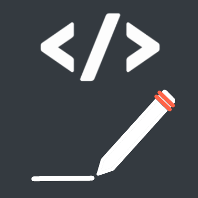

    

# **Ecslate**

> Introducing Slates!! Common tools for Web Developers

- Scribe and execute JavaScript logic in isolation
- Formatting, comparing and beautification in one Desktop app
- Neumorphic UI and multi-font system to sooth your eyes
- Constant support and more upcoming slates

[Guide](#what-is-ecslate)
[Buy me a Coffee](https://www.buymeacoffee.com/sunnyprakash)

