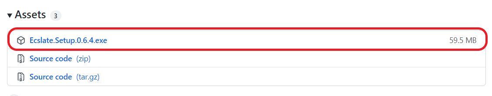

## Windows

Go to <a href="https://github.com/sprakash57/ecslate/releases" target="_blank" rel="noopener noreferrer">release</a> and look for `exe` file under `Assets`.

    

!> Currently it only supports **Windows 8.1+**.

## Linux

Coming soon... 🏃‍♂️

## Mac

Coming soon... 🏃‍♀️