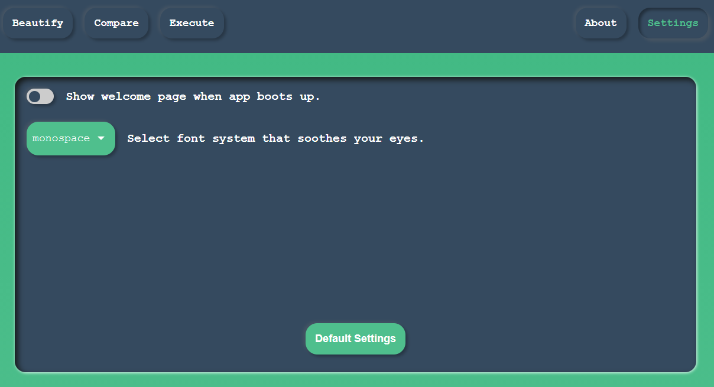

## System font

You can change the system font from the settings tab. Currently it supports six unique font styles.

- Incosolata
- Monospace
- Source code
- System-UI
- Space Mono

## Welcome screen

Welcome screen modal can be turned on/off from the settings as well. By default it is turned on.

## Default settings

Go to settings and look for `Default Settings` button. It will reset everything to the initial setup.
