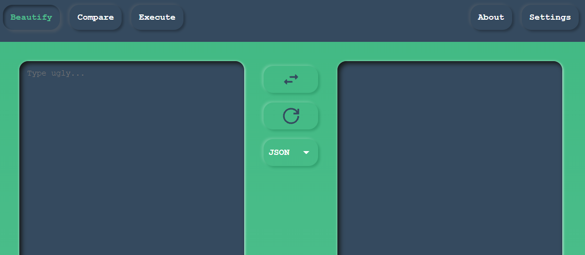
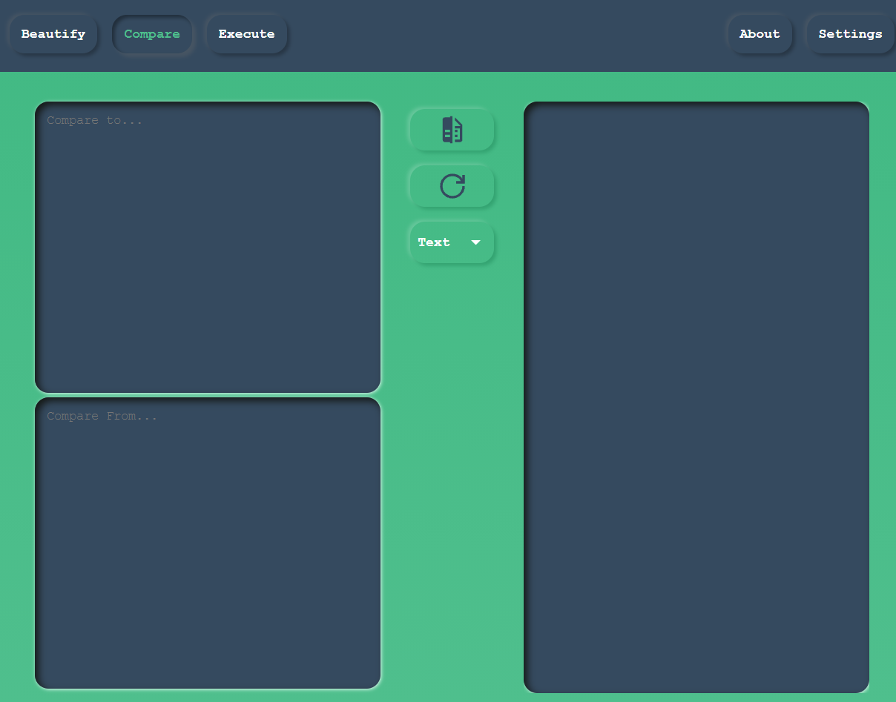
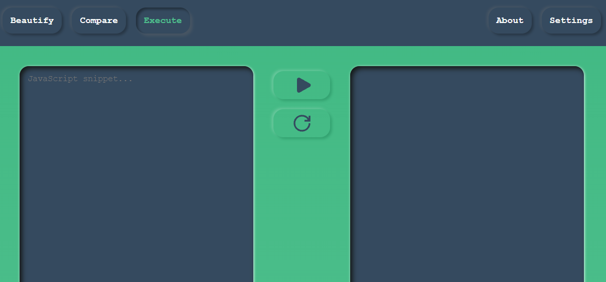

## Beautify

This will help in beautification and formatting of JSON or YAML files. Type/Paste your unformatted code in the left pane. There are couple of controls in the middle pane - Beautify, Reset and Type selection from top to bottom. Hover over them for details. Please note that type selection is important. If you want to format JSON, make sure JSON is selected from dropdown. Same goes for YAML.

## Compare

Ecslate gives you flexibility to compare text or JSON. Just enter the data you need to compare into left pane's top and bottom fields. Click `Compare` from middle pane to render results on the right pane. You can always reset everything with the help of `reset` button present in the middle pane. Don't forget to select proper data type from the dropdown before doing the comparison.

## Execute

Execute lets you run your code snippets in isolation.

